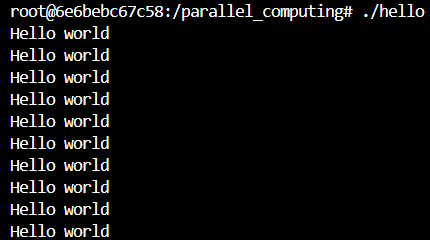
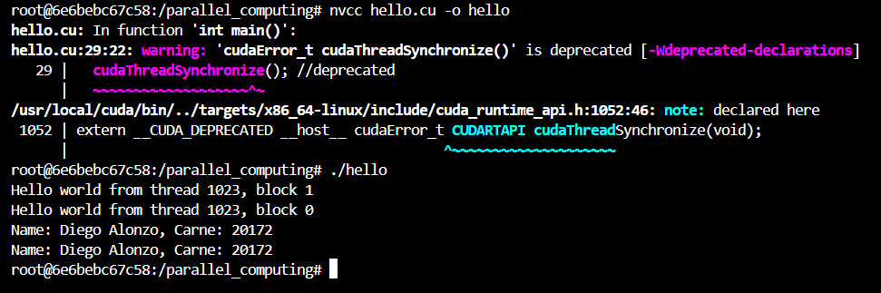
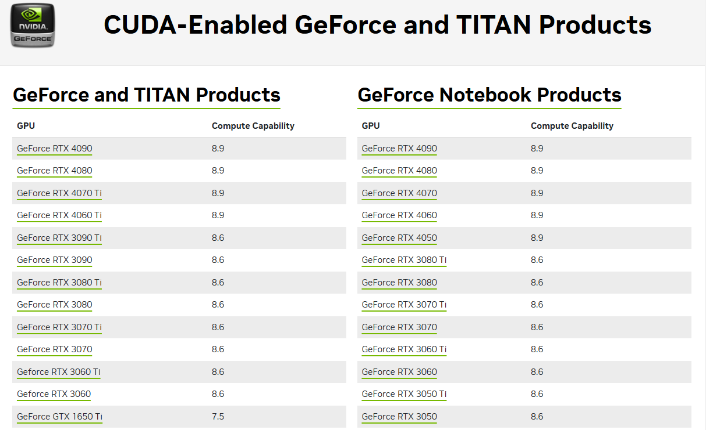
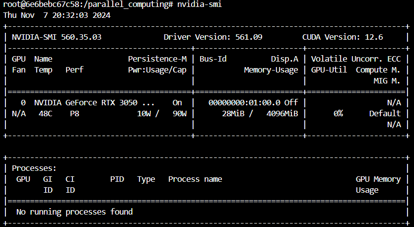
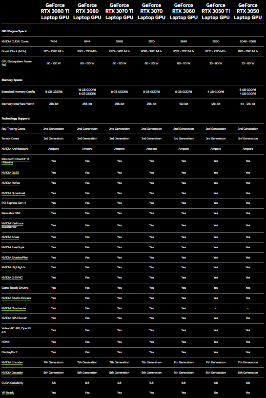
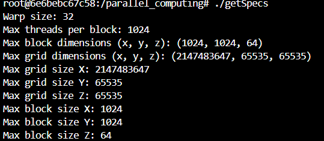
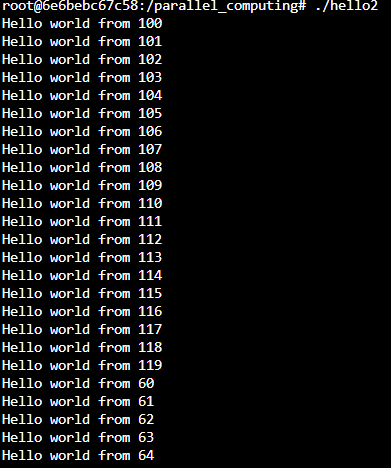
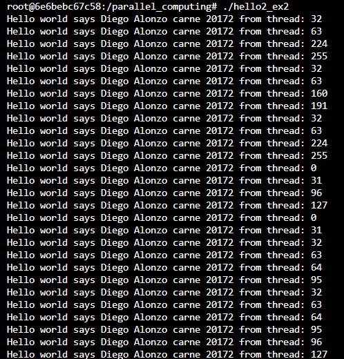
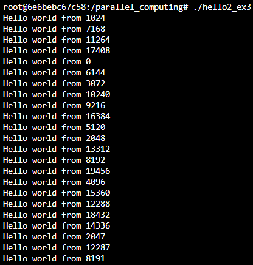

# HDT 3

## ¿Cómo levantar el contenedor?
### Construir el contenedor
```bash
docker build -t parallel_computing .
```
### Levantar el contenedor
```bash
docker run --gpus all -it --name=parallel_computing -v $(pwd):/parallel_computing parallel_computing
```
### Levantar el contenedor cuando ya se creo el contenedor
```bash
docker start -i parallel_computing
```

## Ejercicio 1

a. Se observa que se corre 10 veces

    
b. Modifique el programa para correr 2 bloques de 1024 hilos.  Modificarlo también para que imprima su  nombre  y  carnet.Busque  en  el  despliegue  de  consola  el  mensaje  del  último  hilo  de  la  serie  (1023).


c. Compute Capability





Basado en eso tiene una compute capability de 8.6 dado que es RTX 3500 > RTX 3000

d. Modifique el programa para correr un bloque con 2048 hilos

No imprime nada, esto es debido a que lo máximo de hilos que puede tener es de 1024.

e. Busque en la tabla CC 



No encontré una tabla que me indicara eso por lo que decidí hacer un programa que me obtuviera esas especificaciones:



## Ejercicio 2

a. Descargue,  compile  y  ejecute  hello2.cu.    Observe  la  relación  de  la  configuración  de  la  llamada  al  
kernel con la geometría de los hilos y el resultado.  Escriba la respuesta a los dos enunciados:

- Maximo ID de hilos: 240
- Ejecución de los hilos en orden: Los hilos van en conjuntos de 20 en 20 de manera que empieza en 100 hasta 119, luego pasa a otro bloque y así.



b. Observe que la fórmula genérica para cálculo del ID global está en los comentarios.  Modifique el programa para que imprima también su nombre y carné. Luego, realice la siguiente modificación al programa (al inicio del main) y use la fórmula genérica para derivar el nuevo cálculo de ID 



c. Revise nuevamente la información del Compute Capability respecto a las dimensiones máximas de hilos-bloque en x, y, & z para una grilla.  Cree una configuración para lanzar exitosamente el kernel para  procesar  100,000  datos. (Sugerencia:  busque  una  configuración  que  lance  como  mínimo 100,000  hilos.    Modifique  el  kernel  para  que  imprima  el  mensaje  únicamente  si  es  el  ID  global máximo)

