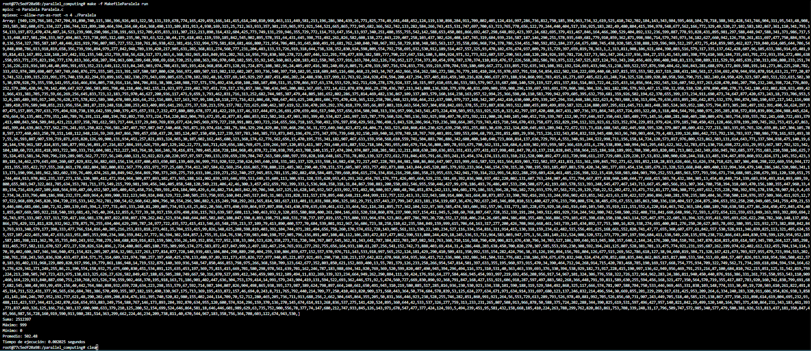
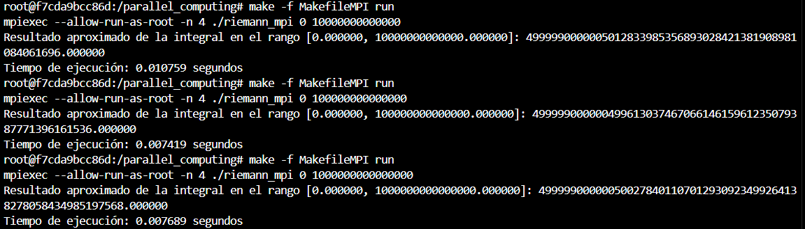

# HDT 3

## ¿Cómo levantar el contenedor?
### Construir el contenedor
```bash
docker build -t parallel_computing .
```
### Levantar el contenedor
```bash
docker run --gpus all -it --name=parallel_computing -v $(pwd):/parallel_computing parallel_computing
```
### Levantar el contenedor cuando ya se creo el contenedor
```bash
docker start -i parallel_computing
```

## Ejercicio 1

a. Se observa que se corre 10 veces

    
b. Modifique el programa para correr 2 bloques de 1024 hilos.  Modificarlo también para que imprima su  nombre  y  carnet.Busque  en  el  despliegue  de  consola  el  mensaje  del  último  hilo  de  la  serie  (1023).


