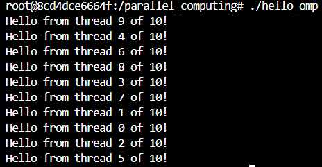
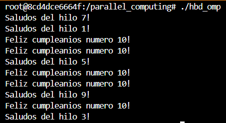
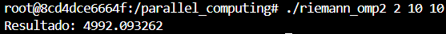
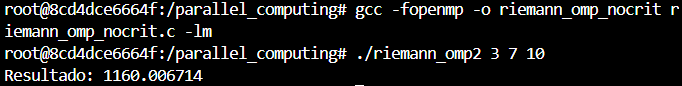
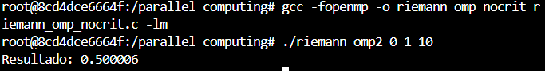

# Lab 1

Diego Andrés Alonzo Medinilla 20172

## Ex 1

Los mensajes no están desplegados en orden debido a que al ser threads puede que unos threads lleguen antes que otros threads.

## Ex 2

## Ex 3

Para X^2 con a = 2 y b = 10 y n = 10^6: 

Para 2X^3 con a = 3 y b = 7 y n = 10^6:

Para sin(x) con a = 0 y b = 1 y n = 10^6:

## Ex 4

Para X^2 con a = 2 y b = 10 y n = 10^6 y threads = 10: 

Para 2X^3 con a = 3 y b = 7 y n = 10^6 y threads = 10:

Para sin(x) con a = 0 y b = 1 y n = 10^6 y threads = 10:

El uso de pragma critical es para garantizar que al momento de acceder memoria compartida, en este caso el resultado solo una pueda modificarlo en ese momento de manera que la información sea concisa.

## Ex 5

Para X^2 con a = 2 y b = 10 y n = 10^6 y threads = 10: 

Para 2X^3 con a = 3 y b = 7 y n = 10^6 y threads = 10:

Para sin(x) con a = 0 y b = 1 y n = 10^6 y threads = 10:

Existe diferencia entre usar una variable global y un arreglo, debido a que en primer lugar la variable global previene que hayan raise conditions. Así mismo, hay que hacer una secuencia para unión de datos finales. Sin embargo, también se debe de denotar que se tiene un peor resultado utilizando un arreglo dado que las aproximaciones fueron peores.