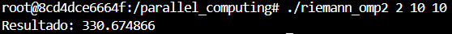

# Lab 1

Diego Andrés Alonzo Medinilla 20172

## Ex 3

Para X^2 con a = 2 y b = 10 y n = 10^6: 

Para 2X^3 con a = 3 y b = 7 y n = 10^6:

Para sin(x) con a = 0 y b = 1 y n = 10^6:

## Ex 4

Para X^2 con a = 2 y b = 10 y n = 10^6 y threads = 10: 

Para 2X^3 con a = 3 y b = 7 y n = 10^6 y threads = 10:

Para sin(x) con a = 0 y b = 1 y n = 10^6 y threads = 10:

El uso de pragma critical es para garantizar que al momento de acceder memoria compartida, en este caso el resultado solo una pueda modificarlo en ese momento de manera que la información sea concisa.