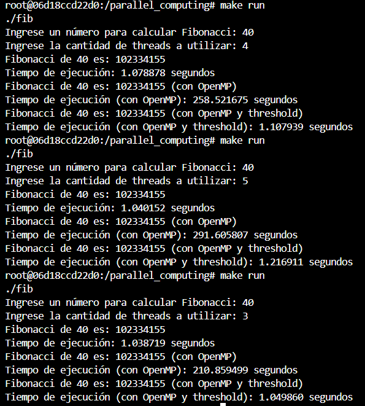

# Parallel Computing

- Diego Andrés Alonzo Medinilla 20172

## ¿Cómo levantar el contenedor?

```bash
docker run -it --name=parallel_computing -v $(pwd):/parallel_computing parallel_computing
```

## Al realizar la paralelización, ¿qué está pasando internamente y por qué el resultado no mejora

En primer lugar open mp crea y gestiona muchas tareas y esto se sobrecarga, de manera que a pesar que se creen en diferentes hilos estas se deben de gestionar, distribuirlas entre hilos y sincronizarlas a partir del taskwait. Esto es producto por ser tareas muy pequeñas ya que solo es sumas y demás lo que precisamente introduce una sobrecarga por gestión de hilos.

##  ¿Por qué al aplicar el threshold obtenemos resultados más parecidos al de la iteración 1?
Porque lo que hace es crear un umbral (límite) para que no cree tareas para tareas tan pequeñas, esto permite que la gestión de los diferentes hilos no sea sobrecargado al ser tareas tan pequeñas y que se mantenga la velocidad de la paralelización sin perder por la gestión de los hilos. De manera que para las tareas pequeñas se convierte en algo secuencial, significando que para valores chicos sea casi el mismo secuencial dependiendo de qué tan cargada sea la tarea.





<table> 
    <thead> 
        <tr> 
            <th>Numero Threads</th>
            <th>Secuencial</th> 
            <th>Paralelo</th> 
            <th>Threshold</th>
            <th>Speedup (Paralelo vs Threshold)</th>
        </tr> 
    </thead> 
    <tbody> 
        <tr> 
            <td>3</td> 
            <td>1.038719</td> 
            <td>210.859499</td> 
            <td>1.049860</td> 
            <td>200.8453498561713</td> 
        </tr> 
        <tr> 
            <td>4</td> 
            <td>1.078878</td> 
            <td>258.521675</td> 
            <td>1.107939</td> 
            <td>233.3356574685068</td> 
        </tr> 
        <tr> 
            <td>5</td> 
            <td>1.040152</td> 
            <td>291.605807</td> 
            <td>1.216911</td> 
            <td>239.6278832223556</td> 
        </tr> 
    </tbody> 
</table>

En promedio el speed up entre el threshold vs paralelo fue 224.6029635156779
