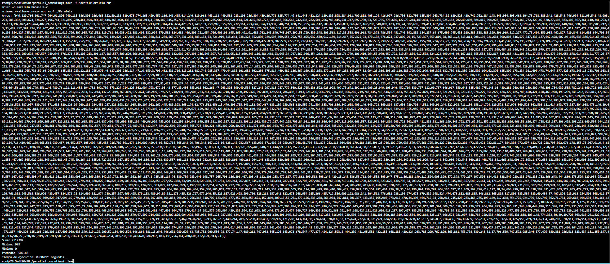

# Parallel Computing

- Diego Andrés Alonzo Medinilla 20172

## ¿Cómo levantar el contenedor?
### Construir el contenedor
```bash
docker build -t parallel_computing .
```
### Levantar el contenedor
```bash
docker run -it --name=parallel_computing -v $(pwd):/parallel_computing parallel_computing
```
## Primera parte

1. Describa con sus propias palabras
    a. ¿Qué es MPI? 
        Message Passing Interface es un estándar para la comunicación de datos entre múltiples procesos que se ejecutan en paralelo, es decir que es una especie de protocolo que permite la comunicación entre procesos en paralelo.
    b. ¿Para qué se utiliza?
        MPI es utilizado en tareas de computación distribuida tal como pueden ser clústers en los que se manejan volumenes de datos distribuidos en cada uno.
    c. ¿Cómo ayuda a la computación paralela?
        MPI permite que tareas extensas se dividan en diferentes procesos pero también en diferentes hardwares lo que permite que sea distribuido y se puedan crear clústers o núcleos, permitiendo comunicación a partir de paso de mensajes. Esto a su vez, permite que se puedan realizar tareas mucho más pesadas al poder manejar varias unidades de cómputo al mismo tiempo.
2. Haga un diagrama o tabla donde se destaquen las diferencias o similitudes de OpenMP y Open MPI

<table border="1">
    <tr>
        <th>Característica</th>
        <th>OpenMP</th>
        <th>Open MPI</th>
    </tr>
    <tr>
        <td>Tipo de paralelismo</td>
        <td>Memoria compartida</td>
        <td>Memoria distribuida</td>
    </tr>
    <tr>
        <td>Modelo de programación</td>
        <td>Utiliza lenguajes como C, C++ y Fortran</td>
        <td>Paso de mensajes para comunicación entre procesos</td>
    </tr>
    <tr>
        <td>Compatibilidad</td>
        <td>Funciona en sistemas con memoria compartida</td>
        <td>Funciona en sistemas distribuidos</td>
    </tr>
    <tr>
        <td>Uso</td>
        <td>Equipo multinucleo</td>
        <td>Clústeres</td>
    </tr>
    <tr>
        <td>Escalabilidad</td>
        <td>Escalabilidad vertical</td>
        <td>Escalabilidad horizontal</td>
    </tr>
</table>


3. Detalle las definiciones de los siguientes conceptos
    a. Communication Domain
        Grupo de procesos que pueden comunicarse entre sí, de manera que se definen los alcances y ámbitos en los cuales los procesos pueden intercambiar mensajes, cada ámbito es aislado de otros ámbitos para evitar problemas de comunicación.
    b. Rank
        Identificador del proceso dentro del Communication Domain en MPI, de manera que este identificador permite diferenciar los procesos.
    c. Subrutinas/Directivas
        Las subrutinas son las funciones específicas de Open MPI que permiten enviar y recibir mensajes.

4. Liste y describa brevemente 4 subrutinas/directivas de Open MPI
    a. MPI_Init es la subrutina que se utiliza para inicializar el entorno de MPI.
    b. MPI_Comm_size es la subrutina que determina el número de procesos de un grupo de comunicación.
    3. MPI_Comm_rank es la subrutina que permite obtener el rank del proceso (identificador rank).
    4. MPI_Send es una subrutina para enviar mensajes entre procesos.

## Segunda Parte
